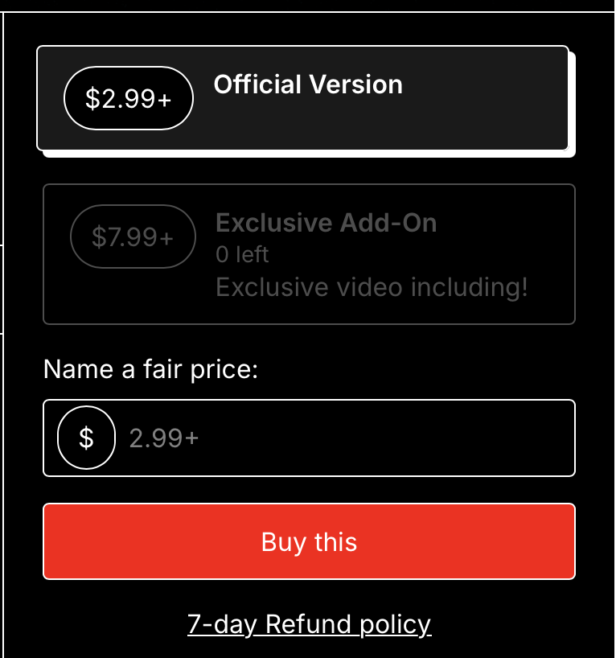

# การสั่งซื้อสินค้าและบริการบน Gumroad

Gumroad เป็นแพลตฟอร์มที่ให้บริการสำหรับการขายสินค้าและบริการต่างๆ ซึ่ง STNET Radio ได้เริ่มใช้งานเมื่อไม่นานมานี้ เพื่ออำนวยความสะดวกให้กับลูกค้าในการสั่งซื้อสินค้าจากเราได้อย่างง่ายดาย

## ขั้นตอนการสั่งซื้อสินค้าและบริการ

1. เข้าสู่เว็บไซต์ชั่วคราวของเราที่ [gumroad.stnetradio.com](https://gumroad.stnetradio.com) หรือเว็บไซต์หลักของ Gumroad ที่ [stnetradio.gumroad.com](https://stnetradio.gumroad.com)
2. เลือกสินค้าหรือบริการที่คุณต้องการ
3. เลือกเวอร์ชันหรือประเภทของสินค้าและบริการ (หากมี)
4. คุณสามารถปรับราคาเพิ่มเติมจากราคาปกติได้ในบางสินค้า
5. กดเลือก "I want this", "Buy This" หรือ "Pay" เพื่อดำเนินการสั่งซื้อสินค้าและบริการ

<figure><figcaption></figcaption></figure>

6. หากมีโค้ดส่วนลดจากโปรโมชั่น หรือสิทธิพิเศษจาก STNET Radio Plus+ สามารถกรอกโค้ดได้ในขั้นตอนนี้
7. กรอกข้อมูลส่วนตัวของคุณ
8. กรอกข้อมูลบัตรเพื่อชำระเงิน
9. หากเป็นสมาชิก PLUS+ สามารถกรอกคะแนนสะสม PLUS+ Member Point ได้
10. เสร็จสิ้นกระบวนการสั่งซื้อ

หลังจากทำรายการเรียบร้อย คุณจะได้รับรายละเอียดของสินค้าหรือบริการที่สั่งซื้อทางอีเมลที่คุณได้ให้ไว้ หากต้องการขอคืนเงิน สามารถศึกษาเงื่อนไขและนโยบายการคืนเงินได้[ที่นี่](/gumroad/refund.md) และหากมีข้อสงสัยหรือพบปัญหา สามารถติดต่อเราได้ตลอดเวลาที่ [support@stnetradio.com](mailto:support@stnetradio.com)

## เว็บไซต์ที่สามารถสั่งซื้อสินค้าและบริการจากเรา

ด้านล่างนี้คือเว็บไซต์อย่างเป็นทางการที่คุณสามารถสั่งซื้อสินค้าและบริการจากเราได้:

* [gumroad.stnetradio.com](https://gumroad.stnetradio.com)
* [sorasukt.stnetradio.com](https://sorasukt.stnetradio.com)
